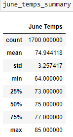
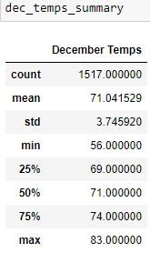

# surfs_up

# Temperature Analysis for Oahu

## Overview of the Analysis
The purpose of this analysis is to provide W. Avy with temperature data for the months of June and December in Oahu, to determine if the surf and ice cream shop business is sustainable year-round.

## Results
Here are some key differences observed in the temperature for the months of June and December:

- June Summary Statistics:
   

- December Summary Statistics:
   

### Key Differences
- The average temperature in June is slightly higher than in December.
- The minimum temperature in December is significantly lower than in June.
- The maximum temperature in June is slightly higher than in December.

## Summary
In summary, the temperature analysis for June and December in Oahu reveals some differences in temperature, however, the temperatures are generally mild year-round. The average temperature in December is slightly lower than in June, but the difference is not significant enough to impact the sustainability of the surf and ice cream shop business year-round.

To gather more weather data for June and December, we recommend performing the following additional queries:

1. Analyze precipitation levels in June and December. This will help determine if there are significant differences in rainfall between these months that could impact business operations.

2. Determine the average temperature and precipitation levels for each station in Oahu for June and December. This will help identify if there are specific locations in Oahu that might be more suitable for the business based on their individual weather conditions.
